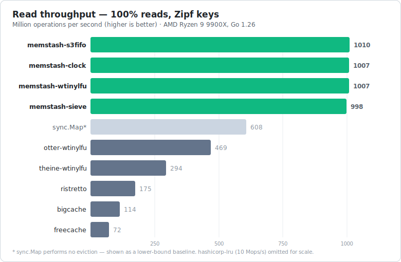

# Memstash

**A blazing-fast, allocation-free, two-level cache for Go. Yet it's convenient and configurable.**

Memstash keeps your hot set in a lock-free in-memory tier (L1). When you need to share state across k8-nodes, or just survive a restart, plug in a second tier (L2) backed by Redis, memcached, or any store you wrap. The memory path stays allocation-free and lock-free: a hit is a single map lookup plus one atomic read. On a miss, memstash fetches from L2, promotes the value into memory, and takes care of writing it back.

```go
c, _ := memstash.New[string, string]()
_ = c.Set(ctx, "hello", "world")
v, ok, err := c.Get(ctx, "hello") // faster than getting from sync.Map
```

## Why memstash?

- **Very fast.** Outperforms Ristretto by ~6× and Otter by ~2× in our [benchmarks](#benchmarks).
- **Top-tier hit ratio.** The S3-FIFO policy keeps pace with the best W-TinyLFU caches (Otter, Theine) and leaves Ristretto far behind, holding up especially well under scans and one-hit wonders.
- **Low memory overhead.** Bigcache comes out on top, but Memstash is in the same league - all well ahead of the rest.
- **Second-level cache out of the box.** Add an L2 (write-through or write-back), and after a restart or on a cold node, it reads from the shared tier instead of your database.
- **Generic and type-safe.** `Cache[K, V]` works with any `comparable` key and any value. No `interface{}`, no casts.
- **Easy on the GC.** Inserts reuse memory blocks from a pool, so the steady state allocates nothing beyond the internal map entry.
- **Adapters included.** Ready-made L2 adapters for Redis, memcached, SQL/PostgreSQL, MongoDB, DynamoDB, Badger, Tarantool and Aerospike - each in its own module so the core stays clean.
- **Singleflight built in.** `GetOrLoad` collapses a stampede of concurrent misses on one key into a single load.

## Table of Contents

- [Installation](#installation)
- [Usage](#usage)
  - [In-memory cache](#in-memory-cache)
  - [Read-through with a loader (singleflight)](#read-through-with-a-loader-singleflight)
  - [Two-level cache with Redis](#two-level-cache-with-redis)
- [Advanced Configuration](#advanced-configuration)
- [L2 Adapters](#l2-adapters)
- [Benchmarks](#benchmarks)
- [License](#license)

## Installation

```sh
go get github.com/zakonnic/memstash
```

Memstash requires Go 1.24+ and has a single core dependency ([xsync](https://github.com/puzpuzpuz/xsync)). Client SDKs are pulled in only by the specific L2 adapter module you import.

## Usage

### In-memory cache

The simplest setup: a bounded, in-process cache with no external dependencies.

```go
package main

import (
	"context"
	"fmt"

	"github.com/zakonnic/memstash"
)

func main() {
	ctx := context.Background()

	// Capacity is measured in weight units; without a cost function every item
	// weighs 1, so this holds 100k entries. An unconfigured cache defaults to 20k.
	c, err := memstash.New[string, string](
		memstash.WithMemoryCapacity(100_000),
	)
	if err != nil {
		panic(err)
	}

	_ = c.Set(ctx, "greeting", "hello")
	if v, ok := c.GetFromMemory("greeting"); ok { // fastest read path: no locks, no allocations
		fmt.Println(v) // hello
	}
}
```

> `GetFromMemory` is the hottest, context-free read path. Use `Get` (which takes a `context.Context`) when an L2 is configured - it may hit the network on a memory miss.

### Read-through with a loader (singleflight)

The most common caching pattern: on a miss, load from the source of truth. Concurrent misses on the same key are automatically **coalesced into a single load**.

```go
c, _ := memstash.New[string, User](
	memstash.WithTTL(5*time.Minute),
)

user, err := c.GetOrLoad(ctx, "user:42", func(ctx context.Context, key string) (User, error) {
	return db.FindUser(ctx, key) // runs once even under a stampede
})
```

Prefer to fix the loader once at construction time? Use `NewLoadable`:

```go
lc, _ := memstash.NewLoadable(
	func(ctx context.Context, id string) (User, error) { return db.FindUser(ctx, id) },
)
user, err := lc.GetOrLoad(ctx, "user:42")
```

> Supports batch-loading with `NewBatchLoadable`, `BatchLoaderFunc`, `BatchGet`, etc.

### Two-level cache with Redis

Add a shared L2 in one call. Memory serves the hot set; anything evicted from L1 (or missing after a restart) is fetched from Redis and promoted back into memory. Writes are **write-back by default**: `Set` returns immediately and a background worker flushes to Redis. The example uses rueidis, but every client in the [adapters table](#l2-adapters) works the same way.

```go
import (
	"github.com/redis/rueidis"

	"github.com/zakonnic/memstash"
	rueidis_adapter "github.com/zakonnic/memstash/l2/rueidis_adapter"
)

client, _ := rueidis.NewClient(rueidis.ClientOption{
	InitAddress: []string{"127.0.0.1:6379"},
})

// JSON values, string keys, 10-minute TTL applied to both tiers (L1 uses the default capacity).
c, _ := rueidis_adapter.NewJSONCache[string, User](client, memstash.WithTTL(10*time.Minute))
defer c.Close()

_ = c.Set(ctx, "user:42", user)     // L1 now, Redis shortly after (write-back)
u, ok, err := c.Get(ctx, "user:42") // L1 hit → returns instantly; L1 miss → Redis, then promoted
```
> Tip: A common way to shard local caches without overlap is to use the Kafka partition key — each partition is consumed by exactly one node, so the cache for a given object lives only on that node.

## Advanced Configuration

memstash is configured with functional options passed to `New` (or to any adapter's `NewCache*`). Some common setups:

**Byte-budgeted cache** - bound by approximate resident bytes instead of item count; the per-item size (key, value, and the cache's own overhead) is estimated automatically:

```go
c, _ := memstash.New[string, []byte](
	memstash.WithMemoryBudget(512 << 20), // ~512 MiB resident
)
```

The built-in estimator covers types whose size is trivial to compute: numerics, pointer-free structs/arrays, strings, slices of fixed-size elements, and pointers to fixed-size types. For anything more complex construction fails with `ErrBudgetNeedsCostFunc` - provide the byte size yourself:

```go
c, _ := memstash.New[string, User](
	memstash.WithMemoryBudget(512<<20),
	memstash.WithCostFunc(func(k string, u User) uint32 { return uint32(len(k) + u.Bytes()) }),
)
```

**Synchronous writes on Set** - write-through policy, L2 updated synchronously:

```go
c, _ := rueidis_adapter.NewJSONCache[string, Session](client,
	memstash.WithWritePolicy(memstash.WriteThrough),
)
```

**Batch operations** - amortize the network round trip; adapters use native pipelining / multi-get where the client supports it:

```go
found, _ := c.BatchGet(ctx, []string{"a", "b", "c"})            // one round trip to L2 for the misses
_ = c.BatchSet(ctx, memstash.List[string, User]{{Key: "a", Value: a}, {Key: "b", Value: b}})
_ = c.BatchDelete(ctx, []string{"a", "b"})                      // follows the write policy, like BatchSet
```

**Observability and iteration** - `Stats()` returns the operation counters (collected with striped counters, so an increment stays contention-free even under heavy parallelism). It's opt-in via `WithStats()`: off by default so a cache that doesn't read `Stats()` doesn't pay for it - without it every getter reads 0. `Iterator()` walks the live first-level entries lock-free, independent of stats:

```go
c, _ := memstash.New[string, User](
	memstash.WithStats(),
)
s := c.Stats() // s.Hits(), s.Misses(), s.Sets(), s.Deletes(), s.Gets(), s.HitRate(), s.MissRate()
for key, value := range c.Iterator() {
	fmt.Println(key, value)
}
```

**Non-string keys with a custom key mapping** - provide a key function for the L2 storage key:

```go
c, _ := rueidis_adapter.NewJSONCache[int, User](client,
	l2.WithKeyFunc(func(id int) string { return "user:" + strconv.Itoa(id) }),
)
```

**Custom serializer** - `NewCache` takes any `memstash.Codec[V]`, so a binary format works just as well as JSON. You can encode each field directly instead of going through JSON:

```go
type Point struct {
	X, Y float64
}

type pointCodec struct{}

func (pointCodec) Marshal(p Point) ([]byte, error) {
	buf := make([]byte, 16)
	binary.LittleEndian.PutUint64(buf[0:8], math.Float64bits(p.X))
	binary.LittleEndian.PutUint64(buf[8:16], math.Float64bits(p.Y))
	return buf, nil
}

func (pointCodec) Unmarshal(data []byte) (Point, error) {
	return Point{
		X: math.Float64frombits(binary.LittleEndian.Uint64(data[0:8])),
		Y: math.Float64frombits(binary.LittleEndian.Uint64(data[8:16])),
	}, nil
}

c, err := rueidis_adapter.NewCache[int, Point](client, pointCodec{},
	l2.WithKeyFunc(strconv.Itoa),
)
```

**Eviction policies** - four built-ins, selected with `WithPolicy`: `PolicyS3FIFO` (the default: quarantine + protected queue + ghost, the best all-rounder under scans and one-hit wonders), `PolicyClock` (GCLOCK, approximates LRU at FIFO cost), `PolicyWTinyLFU` (an admission window gated by a Count-Min frequency sketch that remembers keys across evictions - strong on skewed workloads), and `PolicySIEVE` (a single scan hand over the insertion order - the simplest, with an S3-FIFO-class hit rate). All share the same lock-free read path: a read only sets a 2-bit reference counter on the item's record.

**Custom eviction policy** - implement the `memstash.EvictionPolicy` interface (the same contract the built-ins use: `Add`/`Evict`/`Len`/`Sweep`/`Range`/`Bytes`, all called under the shard mutex) and plug its per-shard factory in:

```go
c, err := memstash.New[string, User](
	memstash.WithCustomEvictionPolicy(func(states memstash.ItemStates[string, User], shardCap int64) memstash.EvictionPolicy[string, User] {
		return newMyPolicy(states, shardCap) // states resolves QNode indices to item records
	}),
)
```

Full option list:

| Option | Purpose |
|---|---|
| `WithMemoryCapacity(n)` | L1 capacity in weight units (defaults to 20 000). |
| `WithMemoryBudget(bytes)` | L1 bound in approximate resident bytes; derives a size-based cost function automatically (mutually exclusive with `WithMemoryCapacity`). |
| `WithCostFunc(fn)` | Per-item weight function (e.g. size in bytes). |
| `WithTTL(d)` | Item lifetime (1-second resolution); applied to L2 writes too. |
| `WithPolicy(p)` | `PolicyS3FIFO` (default), `PolicyClock`, `PolicyWTinyLFU`, or `PolicySIEVE`. |
| `WithCustomEvictionPolicy(fn)` | Plug in your own eviction policy: a per-shard factory returning a `memstash.EvictionPolicy` implementation. |
| `WithShards(n)` | Number of eviction shards (default: auto by GOMAXPROCS). |
| `WithL2Cache(l2)` | Attach a second level directly. |
| `WithWritePolicy(p)` | `WriteBack` (default), `WriteThrough`, or `WriteDisabled`. |
| `WithWriteBackBuffer(n)` | Size of the async write-back buffer. |
| `WithGhostSize(n)` | Capacity (in keys) of the S3-FIFO ghost queues and the W-TinyLFU frequency sketch. |
| `WithOnL2Error(fn)` | Handler for background L2 errors. |
| `WithStats()` | Enables the `Stats()` operation counters. Off by default. |

## L2 Adapters

Each adapter is a separate module (`memstash/l2/<name>_adapter`) so the core never pulls in a client SDK you don't use. Every adapter offers both an "adapter only" constructor (`New`, `NewJSON`, `NewBytes`) and an all-in-one two-level constructor (`NewCache`, `NewJSONCache`, `NewBytesCache`), plus native batch pipelining where the client supports it.

| Module | Backend / client | context |
|---|---|---|
| `l2/goredis_adapter` | Redis - [redis/go-redis](https://github.com/redis/go-redis) | ✅ |
| `l2/rueidis_adapter` | Redis - [redis/rueidis](https://github.com/redis/rueidis) | ✅ |
| `l2/redispipe_adapter` | Redis - [joomcode/redispipe](https://github.com/joomcode/redispipe) | ✅ |
| `l2/redigo_adapter` | Redis - [gomodule/redigo](https://github.com/gomodule/redigo) | partial |
| `l2/gomemcache_adapter` | memcached - [bradfitz/gomemcache](https://github.com/bradfitz/gomemcache) | ❌ |
| `l2/rainycape_adapter` | memcached - [rainycape/memcache](https://github.com/rainycape/memcache) | ❌ |
| `l2/mc_adapter` | memcached - [memcachier/mc](https://github.com/memcachier/mc) | ❌ |
| `l2/valyala_adapter` | memcached - [valyala/ybc](https://github.com/valyala/ybc) (cgo) | ❌ |
| `l2/sql_adapter` | any [database/sql](https://pkg.go.dev/database/sql) engine (SQLite, MySQL, ...) | ✅ |
| `l2/pgx_adapter` | PostgreSQL - [jackc/pgx](https://github.com/jackc/pgx) (native, pipelined) | ✅ |
| `l2/badger_adapter` | embedded - [dgraph-io/badger](https://github.com/dgraph-io/badger) | ❌ |
| `l2/mongo_adapter` | MongoDB - [mongo-driver](https://github.com/mongodb/mongo-go-driver) | ✅ |
| `l2/dynamo_adapter` | DynamoDB - [aws-sdk-go-v2](https://github.com/aws/aws-sdk-go-v2) | ✅ |
| `l2/tarantool_adapter` | Tarantool - [go-tarantool](https://github.com/tarantool/go-tarantool) | ✅ |
| `l2/aerospike_adapter` | Aerospike - [aerospike-client-go](https://github.com/aerospike/aerospike-client-go) | ❌ |

Each adapter takes an interface rather than a concrete client, so it stays independent of the client library's version, and a few libraries are covered without a separate module: `sql_adapter` accepts any `{QueryContext, ExecContext}` (so pgx via database/sql works too), `badger_adapter` covers [badgerhold](https://github.com/timshannon/badgerhold) via `store.Badger()`, and `dynamo_adapter` covers [guregu/dynamo](https://github.com/guregu/dynamo) via its underlying `*dynamodb.Client`.

SQL, Tarantool and other stores without server-side expiration filter expired entries on read and expose a reaper (`DeleteExpired`) to purge them; the note in each package doc explains the specifics.

Rolling your own is straightforward: implement the `memstash.L2Cache[K, V]` interface (`Get`/`BatchGet`/`Set`/`BatchSet`/`Delete`/`BatchDelete`) and pass it to `WithL2Cache`.

## Benchmarks

[Measured](benchmarks/results/out.txt) on an AMD Ryzen 9 9900X (Go 1.26.4). Reproduce with:

```sh
# throughput and allocations (Get / Set / mixed 90-10) vs Ristretto, Otter, hashicorp/lru, plain sync.Map
go -C benchmarks test -run xxx -bench . -benchmem

# hit ratio across Zipf, Zipf+scan, and one-hit-wonder workloads
go -C benchmarks test -run TestHitRate -v
```



### Throughput - ns/op, lower is better

| Cache | GetHit | Set | 90 Get / 10 Set | Set alloc |
|---|--:|--:|----------------:|--:|
| **memstash-s3fifo** | **0.83** | 31.7 |            4.60 | 16 B / 1 |
| **memstash-clock** | **0.85** | 34.2 |            4.55 | 18 B / 1 |
| otter-wtinylfu | 2.04 | 352.2 |           49.77 | 48 B / 1 |
| theine-wtinylfu | 3.27 | 306.4 |           51.53 | 38 B / 0 |
| ristretto | 5.41 | 84.4 |           13.29 | 89 B / 1 |
| bigcache | 8.67 | 38.7 |           23.64 | 23 B / 1 |
| freecache | 14.02 | 20.9 |           14.37 |  0 B / 0 |
| hashicorp-lru | 94.97 | 140.2 |           97.04 | 73 B / 0 |
| sync.Map\* | 1.56 | 11.8 |            4.10 | 63 B / 2 |

\* `sync.Map` performs no eviction - a lower-bound baseline, not a comparable cache.

### Parallel throughput - millions of ops/s, higher is better

| Cache | 100% reads | 75% reads | 50% reads | 25% reads | 0% (writes only) |
|---|--:|--:|--:|--:|-----------------:|
| **memstash-s3fifo** | **1094** | **119** | **70** | **51** |           **43** |
| **memstash-clock** | **1076** | **120** | **74** | **52** |           **37** |
| theine-wtinylfu | 294 | 11 | 6.2 | 4.5 |              3.6 |
| otter-wtinylfu | 182 | 9.6 | 5.3 | 3.6 |              2.8 |
| ristretto | 181 | 39 | 13 | 8.2 |              8.5 |
| bigcache | 101 | 31 | 24 | 22 |               26 |
| freecache | 70 | 69 | 68 | 66 |               67 |
| hashicorp-lru | 10 | 9.4 | 9.6 | 9.6 |              9.5 |
| sync.Map\* | 610 | 155 | 104 | 84 |               74 |

Reads are only half the story. Once writes enter the mix, the W-TinyLFU caches (Otter, Theine) drop by more than an order of magnitude, while memstash stays within about 2× of the eviction-free `sync.Map` baseline. At a 50/50 read-write split it sustains **11–14× their throughput.**

### Hit ratio - higher is better

The Size column is the cache's estimated memory footprint at the end of the one-hit-30% run (key + value bytes plus each implementation's own bookkeeping).

**Capacity = 500k items (~54% of the key space):**

| Cache | Zipf | Zipf+scan | One-hit 30% | Cache Size |
|---|--:|--:|--:|-----------:|
| **memstash-s3fifo** | **75.00%** | **47.25%** | **53.10%** |      33 MB |
| memstash-clock | 74.94% | 46.56% | 52.71% |      29 MB |
| theine-wtinylfu | 74.86% | 47.25% | 52.82% |      54 MB |
| hashicorp-lru | 74.62% | 45.67% | 52.10% |      45 MB |
| otter-wtinylfu | 74.07% | 46.29% | 52.11% |      41 MB |
| bigcache | 73.18% | 44.04% | 50.22% |      25 MB |
| freecache | 72.81% | 43.56% | 50.51% |      54 MB |
| ristretto | 50.32% | 34.60% | 41.37% |      26 MB |

**Capacity = 100k items (~11% of the key space):**

| Cache | Zipf | Zipf+scan | One-hit 30% | Cache Size |
|---|--:|--:|--:|--:|
| **memstash-s3fifo** | **67.05%** | **43.50%** | **49.57%** | 7.3 MB |
| theine-wtinylfu | 66.70% | 42.95% | 49.20% | 12 MB |
| otter-wtinylfu | 64.98% | 41.59% | 47.66% | 7.3 MB |
| memstash-clock | 63.55% | 39.13% | 46.10% | 6.2 MB |
| hashicorp-lru | 61.97% | 36.29% | 44.82% | 9.6 MB |
| bigcache | 60.62% | 36.35% | 43.21% | 6.1 MB |
| freecache | 58.40% | 36.29% | 42.08% | 18 MB |
| ristretto | 35.43% | 24.89% | 30.89% | 4.7 MB |

**Capacity = 10k items (~1% of the key space):**

| Cache | Zipf | Zipf+scan | One-hit 30% | Cache Size |
|---|--:|--:|--:|--:|
| theine-wtinylfu | 51.70% | 33.89% | 41.04% | 1.5 MB |
| **memstash-s3fifo** | **51.49%** | **34.66%** | **41.42%** | 911 kB |
| otter-wtinylfu | 48.58% | 31.44% | 37.84% | 836 kB |
| bigcache | 48.14% | 31.66% | 35.64% | 1.5 MB |
| memstash-clock | 43.79% | 28.90% | 33.70% | 744 kB |
| hashicorp-lru | 41.78% | 27.77% | 32.11% | 1.0 MB |
| freecache | 40.16% | 26.79% | 30.57% | 6.6 MB |
| ristretto | 18.20% | 12.53% | 16.92% | 807 kB |

## License

Apache 2.0
