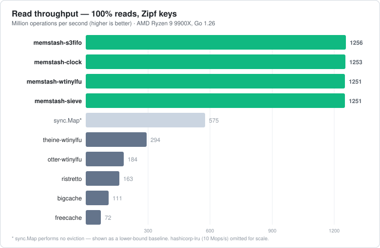

# Memstash

[](https://github.com/zakonnic/memstash/actions/workflows/ci.yml)
[](https://pkg.go.dev/github.com/zakonnic/memstash)
[](https://github.com/zakonnic/memstash/tags)
[](go.mod)
[](LICENSE)

**An unreasonably fast two-level cache for Go — tuned hard at both ends.
Simple by default, deep when you need it.**

Memstash can serve as a pure in-memory cache. It keeps the keys you touch most in your process,
where a read can cost less than a nanosecond (with memstash, anyway). But your whole dataset is
usually far larger — that's when you add a second tier (backed by Redis or any storage you want),
and the same cache will serve millions of entries, shared by every node and still warm after a
restart. Reads fall back to L2 only on memory misses; writes land in memory immediately and reach
L2 in the background.

```go
c, _ := memstash.New[string, string]()
_ = c.Set(ctx, "hello", "world")
v, ok, err := c.Get(ctx, "hello") // faster than a sync.Map lookup
```

## Why memstash?

- **Very fast.** More than 7× the parallel read throughput of
  [Ristretto](https://github.com/dgraph-io/ristretto) and 6×
  [Otter](https://github.com/maypok86/otter)'s; once writes enter the mix the gap widens even more —
  see [benchmarks](#benchmarks).
- **Top-tier hit ratio.** The S3-FIFO policy sits with the best of them — Otter,
  [Theine](https://github.com/Yiling-J/theine-go), Ristretto — and takes the lead at the small and
  mid capacities where a cache actually has to choose, especially under scans and one-hit wonders.
- **Lowest memory overhead.** ~2× smaller footprint than Otter or
  [Bigcache](https://github.com/allegro/bigcache), see
  [benchmarks](#heap-footprint-lower-is-better). Less overhead means more keys.
- **Easy on the GC.** Items live inline in a per-shard flat hash table, so an insert allocates
  nothing. Growth swaps one array for a larger one - a few objects for the collector, never one per
  entry - and stops once the cache is at capacity.
- **Generic and type-safe.** `Cache[K, V]` works with any `comparable` key and any value. No
  `interface{}`, no casts.
- **Second-level cache out of the box.** Add an L2 (write-through or write-back), and after a
  restart or on a cold node, it reads from the shared tier instead of your database.
- **Adapters included.** Ready-made L2 adapters for Redis, memcached, SQL/PostgreSQL, MongoDB,
  DynamoDB, Badger, Tarantool and Aerospike — each in its own module so the core stays clean. With
  **write-back** and **auto-batching**.
- **Singleflight built in.** `GetOrLoad` collapses a stampede of concurrent misses on one key into a
  single load.

## Table of Contents

- [Why memstash?](#why-memstash)
- [Installation](#installation)
- [Usage](#usage)
  - [In-memory cache](#in-memory-cache)
  - [Read-through with a loader (singleflight)](#read-through-with-a-loader-singleflight)
  - [Two-level cache with Redis](#two-level-cache-with-redis)
- [Advanced Configuration](#advanced-configuration)
- [Full option list](#full-option-list)
- [L2 Adapters](#l2-adapters)
- [Benchmarks](#benchmarks)
  - [Throughput](#throughput---nsop-lower-is-better)
  - [Parallel throughput](#parallel-throughput---millions-of-opss-higher-is-better)
  - [Hit ratio](#hit-ratio---higher-is-better)
  - [Heap footprint](#heap-footprint-lower-is-better)
  - [Load generator](#load-generator)
- [Contributing](#contributing)
- [License](#license)

## Installation

```sh
go get github.com/zakonnic/memstash
```

Memstash requires Go 1.24+ and has a single core dependency
([xsync](https://github.com/puzpuzpuz/xsync)). Client SDKs are pulled in only by the specific L2
adapter module you import.

## Usage

### In-memory cache

The simplest setup: a bounded, in-process cache with no external dependencies.

```go
package main

import (
	"context"
	"fmt"

	"github.com/zakonnic/memstash"
)

func main() {
	ctx := context.Background()

	// Capacity is measured in weight units; without a cost function every item
	// weighs 1, so this holds 100k entries. An unconfigured cache defaults to 20k.
	c, err := memstash.New[string, string](
		memstash.WithMemoryCapacity(100_000),
	)
	if err != nil {
		panic(err)
	}

	_ = c.Set(ctx, "greeting", "hello")
	if v, ok := c.GetFromMemory("greeting"); ok { // fastest read path: no locks, no allocations
		fmt.Println(v) // hello
	}
}
```

> Every method is safe to call from any number of goroutines;

### Read-through with a loader (singleflight)

The most common caching pattern: on a miss, load from the source of truth. Concurrent misses on the
same key are automatically **coalesced into a single load**.

```go
c, _ := memstash.New[string, User](
	memstash.WithTTL(5*time.Minute),
)

user, err := c.GetOrLoad(ctx, "user:42", func(ctx context.Context, key string) (User, error) {
	return db.FindUser(ctx, key) // runs once even under a stampede
})
```

Prefer to fix the loader once at construction time? Use `NewLoadable`:

```go
lc, _ := memstash.NewLoadable(
	func(ctx context.Context, id string) (User, error) { return db.FindUser(ctx, id) },
)
user, err := lc.GetOrLoad(ctx, "user:42")
```

> Supports batch-loading with `NewBatchLoadable`, `BatchGetOrLoad`, etc.

### Two-level cache with Redis

Add a shared L2 in one call. Memory serves the hot set; anything evicted from L1 (or missing after a
restart) is fetched from Redis and promoted back into memory. Writes are **write-back by default**:
`Set` returns immediately and a background worker flushes to Redis. Single **Sets are grouped into
batches** asynchronously. The example uses rueidis, but every client in the [adapters
table](#l2-adapters) works the same way.

```go
import (
	"github.com/redis/rueidis"

	"github.com/zakonnic/memstash"
	rueidis_adapter "github.com/zakonnic/memstash/l2/rueidis_adapter"
)

client, _ := rueidis.NewClient(rueidis.ClientOption{
	InitAddress: []string{"127.0.0.1:6379"},
})

// JSON values, string keys, 10-minute TTL applied to both tiers (L1 uses the default capacity).
c, _ := rueidis_adapter.NewJSONCache[string, User](client, memstash.WithTTL(10*time.Minute))
defer c.Close() // waits for the write-back buffer to drain

_ = c.Set(ctx, "user:42", user)     // L1 now, Redis shortly after (write-back)
u, ok, err := c.Get(ctx, "user:42") // L1 hit → returns instantly; L1 miss → Redis, then promoted
```

> Tip: A common way to shard local caches without overlap is to key them by the Kafka partition —
> each partition is consumed by exactly one node, so the cache for a given object lives only on that
> node.

## Advanced Configuration

Memstash is configured with functional options passed to `New` (or to any adapter's `New*Cache`).
Some common setups:

**Byte-budgeted cache** — bound by the byte size of stored data instead of item count; the per-item
size (key and value bytes) is estimated automatically:

```go
c, _ := memstash.New[string, []byte](
	memstash.WithMemoryBudget(512 << 20), // ~512 MiB of keys and values
)
```

The budget is a bound: memstash derives its capacity from it and grows into it rather than
allocating a fixed block up front.

The built-in estimator covers types whose size is trivial to compute: numerics, pointer-free
structs/arrays, strings, slices of fixed-size elements, and pointers to fixed-size types. For
anything more complex, construction fails with `ErrBudgetNeedsCostFunc` — provide the byte size
yourself:

```go
c, _ := memstash.New[string, User](
	memstash.WithMemoryBudget(512 << 20),
	memstash.WithCostFunc(func(k string, u User) uint32 { return uint32(len(k) + u.Bytes()) }),
)
```

**Synchronous writes on Set** — write-through policy, L2 updated synchronously:

```go
c, _ := rueidis_adapter.NewJSONCache[string, Session](client,
	memstash.WithWritePolicy(memstash.WriteThrough),
)
```

**Batch operations** — amortize the network round trip; adapters use native pipelining / multi-get
where the client supports it:

```go
found, err := c.BatchGet(ctx, []string{"a", "b", "c"})            // one round trip to L2 for the misses
dst = c.BatchGetFromMemory([]string{"a", "b"}, dst)
err = c.BatchSet(ctx, memstash.List[string, User]{{Key: "a", Value: a}, {Key: "b", Value: b}})
err = c.BatchDelete(ctx, []string{"a", "b"})                      // follows the write policy, like BatchSet
```

**Observability and iteration** — `Stats()` returns operation counters (collected with striped
counters, so an increment stays contention-free even under heavy parallelism). It's opt-in via
`WithStats()`: off by default so a cache that doesn't read `Stats()` doesn't pay for it — otherwise
counters stay at zero. `Iterator()` walks the live first-level entries lock-free, independent of
stats:

```go
c, _ := memstash.New[string, User](
	memstash.WithStats(),
)
s := c.Stats() // s.Hits(), s.Misses(), s.Sets(), s.Deletes(), s.Gets(), s.HitRate(), s.MissRate(), ...
for key, value := range c.Iterator() {
	fmt.Println(key, value)
}
```

**Removal events** — get told when an item leaves memory, and why. Handlers run after the shard lock
is released, so they may take their time and may call back into the cache; costs 24 B and 13 ns when
a handler is set; otherwise zero overhead:

```go
c, _ := memstash.New[string, *Conn](
	memstash.WithOnDeletion(func(key string, conn *Conn, cause memstash.DeletionCause) {
		deletions++ // cause is one of invalidation, replacement, expiration, eviction, overflow
	}),
)
```

Interested only in the cache's own decisions — expiration, eviction and overflow? Gate the handler
on `cause.Automatic()`.

**Snapshots** — dump the hot set to a file on shutdown and start warm instead of cold. `SaveTo`
streams every live item through the codecs you give it; `LoadFrom` reads it back through the normal
write path, so the capacity, the cost function and the eviction policy all still apply:

```go
f, _ := os.Create("cache.snapshot")
_ = c.SaveTo(f, l2.StringCodec(), l2.JSONCodec[User]()) // keys and values get their own codec
_ = f.Close()

// ...on the next start
f, _ = os.Open("cache.snapshot")
_ = c.LoadFrom(ctx, f, l2.StringCodec(), l2.JSONCodec[User](), memstash.LoadWithTTL)
```

Loading takes options:

| Option | Effect |
|---|---|
| `LoadWithCurrentTTL` | Every item gets a full, fresh lifetime, exactly as `Set` would. The default. |
| `LoadWithTTL` | Expirations are restored on their original schedule: the snapshot records what each item had left plus the moment it was taken, so time spent in the file counts and items already past their deadline are skipped. Capped at the loading cache's own TTL. |
| `LoadToL2` | Also write every loaded item to the second level, following `WritePolicy`. |

Without `LoadToL2` only the first level is touched, and `ctx` goes unused. A truncated or foreign
file is rejected with `ErrBadSnapshot`.

**Non-string keys with a custom key mapping** — provide a key function for the L2 storage key:

```go
c, _ := rueidis_adapter.NewJSONCache[int, User](client,
	l2.WithKeyFunc(func(id int) string { return "user:" + strconv.Itoa(id) }),
)
```

**Custom serializer** — `NewCache` takes any `memstash.Codec[V]`, so a binary format works just as
well as JSON. You can encode each field directly instead of going through JSON:

```go
type Point struct {
	X, Y float64
}

type pointCodec struct{}

func (pointCodec) Marshal(p Point) ([]byte, error) {
	buf := make([]byte, 16)
	binary.LittleEndian.PutUint64(buf[0:8], math.Float64bits(p.X))
	binary.LittleEndian.PutUint64(buf[8:16], math.Float64bits(p.Y))
	return buf, nil
}

func (pointCodec) Unmarshal(data []byte) (Point, error) {
	return Point{
		X: math.Float64frombits(binary.LittleEndian.Uint64(data[0:8])),
		Y: math.Float64frombits(binary.LittleEndian.Uint64(data[8:16])),
	}, nil
}

c, err := rueidis_adapter.NewCache[int, Point](client, pointCodec{},
	l2.WithKeyFunc(strconv.Itoa),
)
```

**Eviction policies** — four built-ins, selected with `WithPolicy`:
[`PolicyS3FIFO`](https://s3fifo.com/) (the default: quarantine + protected queue + ghost, the best
all-rounder under scans and one-hit wonders),
[`PolicyClock`](https://en.wikipedia.org/wiki/Page_replacement_algorithm#Clock) (GCLOCK,
approximates LRU at FIFO cost), [`PolicyWTinyLFU`](https://arxiv.org/abs/1512.00727) (an admission
window gated by a Count-Min frequency sketch that remembers keys across evictions — strong on skewed
workloads), and [`PolicySIEVE`](https://sievecache.com/) (a single scan hand over the insertion
order — the simplest, with an S3-FIFO-class hit rate). All share the same lock-free read path: a
read only sets a 2-bit reference counter on the item's meta word.

**Custom eviction policy** — implement the `memstash.EvictionPolicy` interface (the same contract
the built-ins use: `Add`/`Evict`/`Len`/`Sweep`/`Rebuild`/`Bytes`, all called under the shard mutex)
and plug its per-shard factory in:

```go
c, err := memstash.New[string, User](
	memstash.WithCustomEvictionPolicy(func(items memstash.Items[string, User], shardCap int64) memstash.EvictionPolicy[string, User] {
		return newMyPolicy(items, shardCap) // items resolves QNode indices to the cached items
	}),
)
```

Affects the hit rate — you control which items stay and which get evicted, for instance based on the items themselves.

## Full option list

| Option | Purpose                                                                                                                                       |
|---|-----------------------------------------------------------------------------------------------------------------------------------------------|
| `WithMemoryCapacity(n)` | L1 capacity in weight units (defaults to 20k).                                                                                                |
| `WithMemoryBudget(bytes)` | L1 bound in bytes of stored keys and values; derives a size-based cost function automatically (mutually exclusive with `WithMemoryCapacity`). |
| `WithCostFunc(fn)` | Per-item weight function (e.g. size in bytes).                                                                                                |
| `WithTTL(d)` | Item lifetime (1-second resolution up to ~36h, proportionally coarser above that); applied to L2 writes too. Required for `SetWithTTL`. |
| `WithRefreshTTLOnGet()` | Sliding expiration: every L1 hit extends the item by a full `WithTTL` lifetime — including entries written with `SetWithTTL`. |
| `WithPolicy(p)` | `PolicyS3FIFO` (default), `PolicyClock`, `PolicyWTinyLFU`, or `PolicySIEVE`.                                                                  |
| `WithCustomEvictionPolicy(fn)` | Plug in your own eviction policy: a per-shard factory returning a `memstash.EvictionPolicy` implementation.                                   |
| `WithPreallocatedSize()` | Allocate every shard's item table up front, at the size filling to capacity would grow it to anyway. Not available with `WithCostFunc` / `WithMemoryBudget`. |
| `WithShardsCount(n)` | Number of eviction shards (default: auto by GOMAXPROCS).                                                                                      |
| `WithL2Cache(l2)` | Attach a second level directly.                                                                                                               |
| `WithWritePolicy(p)` | How writes reach L2, ignored when no L2 is attached: `WriteBack` (default) hands `Set` to the background worker, `WriteThrough` writes on `Set` and returns the L2 error, `WriteDisabled` makes L2 read-only. Deletes follow the same policy as writes. |
| `WithWriteBackBuffer(n)` | Size of the async write-back buffer.                                                                                                          |
| `WithBatchingForWriteBack()` / `WithNoBatchingForWriteBack()` / `WithAdaptiveBatchingForWriteBack()` | How the write-back worker drains its buffer to L2: coalesced into `BatchSet` (default), one `Set` per write, or adaptive.                     |
| `WithGhostSize(n)` | Capacity (in keys) of the S3-FIFO ghost queues and the W-TinyLFU frequency sketch.                                                            |
| `WithOnL2Error(fn)` | Handler for background L2 errors.                                                                                                             |
| `WithOnDeletion(fn)` | Handler for every item leaving L1, with the cause (`CauseInvalidation`, `CauseReplacement`, `CauseExpiration`, `CauseEviction`, `CauseOverflow`). |
| `WithPanicHandler(fn)` | Handler for the panics the cache recovers on its own goroutines and around a background loader. Receives what `recover()` returned and whether the panic was passed on (to `OnL2Error`, or to waiters as `ErrLoaderPanic`); `false` means the handler is its only trace. |
| `WithStats()` | Enables the `Stats()` operation counters. Off by default.                                                                                     |

## L2 Adapters

Each adapter is a separate module (`memstash/l2/<name>_adapter`) so the core never pulls in a client
SDK you don't use. Every adapter offers both an "adapter only" constructor (`New`, `NewJSON`,
`NewBytes`) and an all-in-one two-level constructor (`NewCache`, `NewJSONCache`, `NewBytesCache`),
plus native batch pipelining where the client supports it.

The write path favors throughput by default: instead of one round trip per key, the background
write-back worker coalesces the Sets into the adapter's native `BatchSet` (an `MSET` or a pipeline).

| Module | Backend / client | context |
|---|---|---|
| `l2/goredis_adapter` | Redis — [redis/go-redis](https://github.com/redis/go-redis) | ✅ |
| `l2/rueidis_adapter` | Redis — [redis/rueidis](https://github.com/redis/rueidis) | ✅ |
| `l2/redispipe_adapter` | Redis — [joomcode/redispipe](https://github.com/joomcode/redispipe) | ✅ |
| `l2/redigo_adapter` | Redis — [gomodule/redigo](https://github.com/gomodule/redigo) | partial |
| `l2/gomemcache_adapter` | memcached — [bradfitz/gomemcache](https://github.com/bradfitz/gomemcache) | ❌ |
| `l2/rainycape_adapter` | memcached — [rainycape/memcache](https://github.com/rainycape/memcache) | ❌ |
| `l2/mc_adapter` | memcached — [memcachier/mc](https://github.com/memcachier/mc) | ❌ |
| `l2/valyala_adapter` | memcached — [valyala/ybc](https://github.com/valyala/ybc) (cgo) | ❌ |
| `l2/sql_adapter` | any [database/sql](https://pkg.go.dev/database/sql) engine (SQLite, MySQL, ...) | ✅ |
| `l2/pgx_adapter` | PostgreSQL — [jackc/pgx](https://github.com/jackc/pgx) (native, pipelined) | ✅ |
| `l2/badger_adapter` | embedded — [dgraph-io/badger](https://github.com/dgraph-io/badger) | ❌ |
| `l2/mongo_adapter` | MongoDB — [mongo-driver](https://github.com/mongodb/mongo-go-driver) | ✅ |
| `l2/dynamo_adapter` | DynamoDB — [aws-sdk-go-v2](https://github.com/aws/aws-sdk-go-v2) | ✅ |
| `l2/tarantool_adapter` | Tarantool — [go-tarantool](https://github.com/tarantool/go-tarantool) | ✅ |
| `l2/aerospike_adapter` | Aerospike — [aerospike-client-go](https://github.com/aerospike/aerospike-client-go) | ❌ |

Each adapter takes an interface rather than a concrete client, so it stays independent of the client
library's version, and a few libraries are covered without a separate module: `sql_adapter` accepts
any `{QueryContext, ExecContext}` (so pgx via database/sql works too), `badger_adapter` covers
[badgerhold](https://github.com/timshannon/badgerhold) via `store.Badger()`, and `dynamo_adapter`
covers [guregu/dynamo](https://github.com/guregu/dynamo) via its underlying `*dynamodb.Client`.

SQL, Tarantool and other stores without server-side expiration filter expired entries on read and
expose a reaper (`DeleteExpired`) to purge them; the note in each package doc explains the
specifics.

Rolling your own is straightforward: implement the `memstash.L2Cache[K, V]` interface
(`Get`/`BatchGet`/`Set`/`BatchSet`/`Delete`/`BatchDelete`) and pass it to `WithL2Cache`.

## Benchmarks

[Measured](benchmarks/results/out.txt) on an AMD Ryzen 9 9900X (Go 1.26.4). Reproduce with:

```sh
make bench

# make help # List all commands and benchmarks
```
Configuration for all of them lives in [benchmarks/adapters.go](benchmarks/adapters.go).



### Throughput - ns/op, lower is better

| Cache | GetHit | Get (50% hit rate) | Set | 90 Get / 10 Set | Set alloc |
|---|--:|------------------:|--:|----------------:|--:|
| **memstash-s3fifo** | **0.73** |          **1.15** | 26.2 |            3.59 | 1 B / 0 |
| **memstash-clock** | **0.73** |          **1.12** | 23.9 |            3.51 | 1 B / 0 |
| **memstash-wtinylfu** | **0.74** |          **1.17** | 24.8 |            3.48 | 1 B / 0 |
| **memstash-sieve** | **0.74** |          **1.19** | 23.3 |            3.52 | 0 B / 0 |
| otter-wtinylfu | 2.05 |              3.32 | 288.9 |           49.30 | 48 B / 1 |
| theine-wtinylfu | 3.30 |              3.31 | 315.0 |           50.51 | 38 B / 0 |
| ristretto | 5.64 |              6.19 | 142.2 |           31.26 | 85 B / 1 |
| bigcache | 8.86 |              7.17 | 37.9 |           20.85 | 24 B / 2 |
| freecache | 13.73 |             11.70 | 20.8 |           14.13 |  0 B / 0 |
| hashicorp-lru | 93.43 |             86.53 | 127.6 |           97.35 | 58 B / 0 |
| sync.Map\* | 1.62 |              1.68 | 11.6 |            4.11 | 63 B / 2 |

\* `sync.Map` performs no eviction — a lower-bound baseline, not a comparable cache.

### Parallel throughput - millions of ops/s, higher is better

| Cache | 100% reads | 75% reads | 50% reads | 25% reads | 0% (writes only) |
|---|--:|--:|--:|--:|-----------------:|
| **memstash-s3fifo** | **1256** | **155** | **103** | **76** |           **63** |
| **memstash-clock** | **1253** | **160** | **100** | **66** |           **63** |
| **memstash-wtinylfu** | **1251** | **146** | **103** | **66** |           **63** |
| **memstash-sieve** | **1251** | **156** | **90** | **59** |           **44** |
| theine-wtinylfu | 294 | 10 | 5.8 | 4.4 |              3.6 |
| otter-wtinylfu | 184 | 9.7 | 5.3 | 3.6 |              2.8 |
| ristretto | 163 | 19 | 9.4 | 6.2 |              4.7 |
| bigcache | 111 | 34 | 27 | 25 |               28 |
| freecache | 72 | 69 | 68 | 68 |               68 |
| hashicorp-lru | 10 | 10 | 9.8 | 9.5 |              9.5 |
| sync.Map\* | 575 | 155 | 110 | 86 |               77 |

Reads are only half the story. Once writes enter the mix, the W-TinyLFU caches (Otter, Theine) slow
down by more than an order of magnitude, while memstash stays within reach of the eviction-free
`sync.Map` baseline.

### Hit ratio - higher is better

The "Est. Size" column is the cache's estimated memory footprint at the end of the one-hit-30% run
(key + value bytes plus each implementation's own bookkeeping). This is a rough estimate — for
measured resident bytes see [heap footprint](#heap-footprint-lower-is-better).

**Capacity = 500k items (~36% of the working set):**

| Cache | Zipf | Zipf+scan | One-hit 30% | Est. Size |
|---|--:|--:|--:|----------:|
| ristretto | 58.30% | 35.35% | 37.02% | 68 MB |
| **memstash-s3fifo** | **58.13%** | **34.66%** | **36.39%** | 34 MB |
| memstash-wtinylfu | 57.96% | 34.74% | 36.53% | 34 MB |
| memstash-sieve | 57.73% | 34.07% | 35.86% | 35 MB |
| theine-wtinylfu | 57.54% | 34.63% | 35.66% | 54 MB |
| memstash-clock | 57.04% | 33.01% | 34.63% | 30 MB |
| otter-wtinylfu | 56.06% | 33.17% | 34.41% | 41 MB |
| hashicorp-lru | 55.64% | 31.61% | 32.99% | 45 MB |
| bigcache | 51.29% | 27.95% | 29.23% | 25 MB |
| freecache | 51.01% | 28.32% | 29.64% | 54 MB |

**Capacity = 100k items (~7% of the working set):**

| Cache | Zipf | Zipf+scan | One-hit 30% | Est. Size |
|---|--:|--:|--:|--:|
| memstash-wtinylfu | 41.81% | 26.30% | 27.07% | 8.4 MB |
| **memstash-s3fifo** | **41.11%** | **26.33%** | **27.18%** | 8.4 MB |
| theine-wtinylfu | 40.95% | 25.98% | 26.50% | 12 MB |
| memstash-sieve | 39.63% | 25.20% | 25.14% | 8.3 MB |
| ristretto | 39.10% | 23.55% | 24.85% | 14 MB |
| otter-wtinylfu | 37.77% | 23.55% | 23.77% | 7.3 MB |
| memstash-clock | 33.12% | 18.22% | 18.93% | 7.3 MB |
| hashicorp-lru | 30.03% | 15.62% | 16.53% | 9.6 MB |
| bigcache | 28.26% | 15.71% | 15.48% | 6.1 MB |
| freecache | 25.65% | 14.48% | 14.00% | 19 MB |

**Capacity = 10k items (~1% of the working set):**

| Cache | Zipf | Zipf+scan | One-hit 30% | Est. Size |
|---|--:|--:|--:|--:|
| theine-wtinylfu | 15.36% | 9.24% | 10.24% | 1.5 MB |
| **memstash-s3fifo** | **14.78%** | **9.89%** | **10.28%** | 1.1 MB |
| memstash-wtinylfu | 14.47% | 8.31% | 8.63% | 1.1 MB |
| otter-wtinylfu | 13.83% | 8.47% | 7.48% | 805 kB |
| memstash-sieve | 13.50% | 8.86% | 8.83% | 1.1 MB |
| bigcache | 11.75% | 7.46% | 6.09% | 1.5 MB |
| ristretto | 10.15% | 5.58% | 5.39% | 1.9 MB |
| freecache | 6.00% | 3.93% | 3.03% | 7.1 MB |
| memstash-clock | 5.33% | 3.50% | 2.62% | 926 kB |
| hashicorp-lru | 5.01% | 3.30% | 2.49% | 1.0 MB |

### Heap footprint, lower is better

Each cache is filled with 100M `uint64 -> uint64` entries — 16 bytes of raw payload apiece — and the
heap growth it causes is read back from the Go runtime, so these are real resident bytes rather than
the cache's own estimate. The [measurements](benchmarks/results/heap-size-100kk.txt) run one
contender at a time: a single pass costs several GiB. The caches that only accept byte-slice or
string keys were given the same values converted to `[8]byte`.

| Cache | Heap | B/entry |  Get hot | Get full | Set hot | Set full |
|---|--:|--:|---------:|--:|--:|--:|
| xsync.MapOf\* | 3.7 GiB | 39.24 |    1.53 ns | 9.16 ns | 5.79 ns | 13.25 ns |
| **memstash-s3fifo** | **3.9 GiB** | **42.05** | **2.49 ns** | **7.48 ns** | **17.64 ns** | **23.04 ns** |
| freecache | 5.7 GiB | 61.53 |    37.10 ns | 48.48 ns | 38.80 ns | 50.25 ns |
| otter-wtinylfu | 7.6 GiB | 81.98 |     3.64 ns | 13.71 ns | 422.8 ns | 525.2 ns |
| bigcache | 7.7 GiB | 84.84 |    10.38 ns | 19.86 ns | 40.74 ns | 46.83 ns |
| hashicorp-lru | 9.7 GiB | 104.2 |    133.8 ns | 502.4 ns | 145.8 ns | 485.2 ns |
| theine-wtinylfu | 11 GiB | 115.0 |     6.97 ns | 20.29 ns | 339.2 ns | 463.4 ns |
| ristretto | 14 GiB | 153.1 |    18.48 ns | 22.74 ns | 263.3 ns | 281.9 ns |

\* `xsync.MapOf` performs no eviction — a lower-bound baseline, not a comparable cache.

The four latency columns are measured on that same filled cache, so they show what a read and a
write cost at 100M entries rather than at a benchmark-sized capacity. **hot** replays a 64k-key
window from the middle of the fill: it stays in CPU cache and measures the code path itself.
**full** draws uniformly over all 100M keys, so nearly every op is an LLC and a TLB miss — the gap
between the two columns is what memory stalls cost per op at this cardinality. Both are aggregate
ns/op across all cores, like the parallel table above. As a side effect, this shows how well the library
is optimized for hardware caches and CPU-level operations. Memstash is squeezed to the max — with short
keys, a typical read costs one memory load — even a plain Go map takes at least two.

### Load generator

Long-running soak test, located [in benchmarks](benchmarks/load_generator) (run `make load-generator`), this tool hammers three independently configured 
caches with continuous, realistic load to verify correctness and measure real-world hit rates under
sustained pressure.

Three parallel scenarios, each with its own cache, goroutines, and key space:

| | Values | Capacity               | L2 | Mix | Load                                         |
|---|---|------------------------|---|---|----------------------------------------------|
| `scenario-1` | web sessions, ~170–490 B | 20k items              | none | 90% Get | 10 goroutines, 10k rps total                 |
| `scenario-2` | CDN assets, 0.6–64 KiB | 20k items              | Redis cluster | 50/50 | 5 goroutines, 100k rps total                 |
| `scenario-3` | DB rows, ~250 B | ~10 MB (cost-weighted) | Redis cluster | 90% Get | 40 goroutines, 1 hot (10k rps) + 30k rps shared |

Keys follow Zipf distribution over a key space several times larger than L1 capacity, plus a `random_percent` share drawn uniformly
instead.

**Every Get is verified** against a pre-computed truth map. Everything that can go wrong lands in `errors.log`.
Logged once per minute + on shutdown (`scenario-N.log`, JSON lines).
Tuning via [config.yaml](benchmarks/load_generator/config.yaml). All fields optional.

**What you can check:**
- **Correctness** — empty `errors.log` after hours of 150k+ rps
- **Real hit rates** — configure `size`, `key_space`, `zipf_s` to match your service
- **L1 vs L2 split** — traffic reaching Redis, L2 hit rate under working set rotation
- **Memory/goroutine stability** — flat metrics over hours = no leaks
- **Load cost** — `process_cpu_cores` at target rps
- **Throughput ceilings** — `ops_per_sec` below configured rps reveals bottlenecks
- **Pre-production testing** — point `redis_address` at staging

## Contributing

Bug reports and focused pull requests are welcome — see [CONTRIBUTING.md](CONTRIBUTING.md) for the
repository layout, the test and lint commands, and the benchmarking rules that apply to changes on
the hot path. Notable changes are recorded in the [changelog](CHANGELOG.md); security reports go
through the [security policy](SECURITY.md).

## License

[Apache 2.0](LICENSE)
